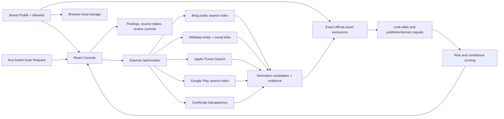

# Implementation plan — Watchtower Digital Risk Protection

## Product and implementation approach

Build a responsive, monochrome digital-risk investigation console for Social & App Monitoring. The website lets an analyst define a brand profile, start an on-demand scan for any brand, review likely official handles and possible impersonation candidates across social, app-store, and web/domain sources, and keep legitimate assets out of the suspicious queue. A compact in-product architecture view and an interactive demo mode provide the requested diagram/demo deliverables.

Use the initialized React 19 + TypeScript + Vite frontend, Express server, tRPC starter and installed UI primitives. Add a narrowly scoped Express monitoring endpoint to orchestrate public source requests; keep API calls on the server, return normalized results with evidence URLs, per-source status and confidence/risk rationale, and never imply that search-index results prove ownership or cover an entire platform. Use public, keyless sources only: Wikidata's public [entity search API](https://www.wikidata.org/w/api.php) and [entity JSON API](https://www.wikidata.org/wiki/Special:EntityData/) for indexed social links and official-site assertions; Apple's public [iTunes Search API](https://itunes.apple.com/search) for app candidates; Bing's public [web search](https://www.bing.com/search) for social/web candidates and Google Play index discovery; and CertSpotter's [certificate transparency API](https://api.certspotter.com/v1/issuances) for configured official domains. Live probes confirmed the Wikidata API returned social-link properties for Nike, Airbnb and Notion; Bing web search, Apple iTunes Search and CertSpotter respond. DuckDuckGo HTML returned an HTTP 202 challenge, direct Google Play page fetch timed out, and crt.sh returned a 502. Bing wraps outbound result URLs in `/ck/a` links with URL-safe-base64 targets; unwrapping them is required to inspect result hosts. If a source is blocked, rate-limited, incomplete, or unsupported, report that source state and link the user to a direct search rather than inventing candidates. Registry assertions can be stale and candidates are not verified against platform APIs; label registry links as such. This is candidate discovery, not authenticated platform-wide monitoring. Use cautious similarity/risk signals and show why each item appeared.

Brand profiles will be managed in the browser's local storage for this unauthenticated prototype, including official social handles, trusted domains, official applications/publishers, identifiers and logo URL. Exact/canonical matches against the allowlist are excluded from suspicious findings. The database-enabled starter is retained as initialized; the prototype does not expose private user data or require an external API key. Request names are validated, URL values are normalized/sanitized, source requests are time-bounded, and failures degrade independently.

## System architecture and data flow

The diagram's sources are best-effort public sources. A source-state record (`available`, `partial`, `blocked`, or `unavailable`) accompanies the result set so missing coverage is visible. Search snippets/metadata are evidence, not a takedown or proof of malicious intent. User-provided official handles/apps/domains/publishers take precedence for exclusion; exact canonical identifiers are excluded from the threat queue. Disclosed third-party companions/integrations are shown as such rather than automatically placed in the suspicious queue. Uploaded logos can be compared locally to returned app artwork using a small perceptual hash; social-profile images are not exposed by the chosen public sources, so social logo review remains manual. Similar names alone are low-confidence and must not be labeled malicious.

## Project structure

- `client/src/pages/Watchtower.tsx` — dashboard layout, overview, scan form, profile setup, source-status display, findings list, filters and evidence detail; the root route renders this page.
- `client/src/watchtower.css` — responsive design tokens and bespoke monochrome styling.
- `client/src/lib/monitoring.ts` — typed frontend contracts and request utilities if needed.
- `server/_core/index.ts` — existing Express entry and mounted monitor endpoint.
- `server/monitoring.ts` — input validation, public-source adapters, normalization, allowlist exclusion, similarity/risk scoring, independent timeouts and graceful source errors.
- `shared/types.ts` (or a focused shared module) — normalized profile, finding, source-health and scan response contracts.
- `client/public/manus-routes.json` — canonical page route manifest served from the Vite root.
- `architecture.mmd` — editable architecture diagram source embedded/referenced by the product documentation.
- `plan.md` / `TODO.md` — implementation/design record and outcome tracking.

## User experience and visual design

- **Design Movement:** Swiss editorial information design translated into an understated security operations console.
- **Core Principles:** Quiet precision; evidence before alarm; generous whitespace; fast triage with clear system state.
- **Color Philosophy:** Strictly black, white, and neutral grays. High contrast makes source state and evidence legible without using alarm colors to imply certainty.
- **Layout Paradigm:** Persistent narrow left rail, top-level search band, asymmetric editorial dashboard, and a vertically ordered findings feed rather than a centered generic card grid.
- **Signature Elements:** A custom split-ring signal mark; fine technical rules and mono source labels; small confidence-meter bars with text labels.
- **Interaction Philosophy:** Direct manipulation, useful empty/loading/error states, visible evidence links, and confirmation before removing or changing official-asset records.
- **Animation:** Add a slow monochrome 3D orbital signal around the hero mark, a 10-second low-amplitude floating perspective on the sample pipeline panel, brief translateZ/perspective entry for its flow nodes, and subtle 3D lift on review surfaces. Keep motion slow, non-blocking and low-contrast; remove movement and transitions under `prefers-reduced-motion` and avoid flashing effects.
- **Typography System:** Manrope for a compact editorial headline hierarchy, DM Sans for readable UI/body copy, and DM Mono for source labels, timestamps, and identifiers.
- **Brand Essence:** A focused early-warning console for security and brand teams that turns public discovery into explainable, reviewable leads. Personality: exact, composed, transparent.
- **Brand Voice:** Short, evidence-led statements. Examples: “Find look-alikes. Keep the real ones clear.” “Candidates from public sources—not proof of abuse.”
- **Wordmark & Logo:** WATCHTOWER wordmark with a custom split-ring/eye-like circular marker and a vertical signal notch, built from monochrome geometric strokes.
- **Signature Brand Color:** Ink black (`#111111`), ownable through distinctive usage and balanced by white/soft-gray canvas tones.

## Dependencies, serving, and constraints

No additional packages are necessary unless implementation proves otherwise; use the supplied React/Express, fetch, Lucide/icons already present, and browser storage. The app is served as an Express container on configured port 3000, with `/api/health` and `/api/monitor/scan`. Keep browser-facing URLs relative. No third-party credentials are required. External HTTP fetches are best-effort, independently time-bounded, and do not prevent other providers from returning. This live prototype cannot guarantee exhaustive social-network coverage, verify the current identity or status of a handle, inspect closed/private platform data, or initiate takedowns. The UI must disclose these limits alongside findings.
